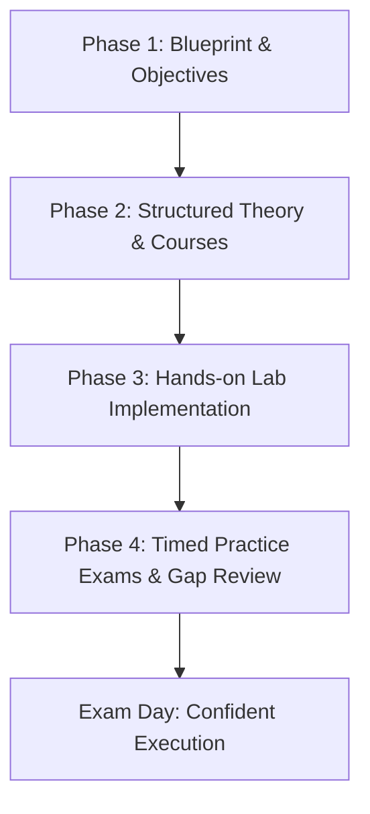

# Developer Certification Handbook 🎯

> **The ultimate open-source guide to tech certifications: exam blueprints, syllabus breakdowns, screening interview questions, salary ROI, and hands-on preparation paths for software engineers, cloud architects, DevOps practitioners, and cybersecurity specialists.**

Maintained alongside [careers.codes](https://www.careers.codes) to help engineers worldwide pass vendor exams and unlock high-paying global remote roles.

---

## 📌 Table of Contents

- [Why Tech Certifications Matter in 2026](#-why-tech-certifications-matter-in-2026)
- [Certification Domains](#-certification-domains)
  - [1. Cloud & Infrastructure](#1-cloud--infrastructure)
  - [2. DevOps & Container Orchestration](#2-devops--container-orchestration)
  - [3. Artificial Intelligence & Data Engineering](#3-artificial-intelligence--data-engineering)
  - [4. Cybersecurity & Ethical Hacking](#4-cybersecurity--ethical-hacking)
  - [5. Software Development & Web](#5-software-development--web)
  - [6. Strategy, ROI & Technical Screening](#6-strategy-roi--technical-screening)
- [Comprehensive Certification Matrix](#-comprehensive-certification-matrix)
- [Salary ROI & Remote Hiring Impact](#-salary-roi--remote-hiring-impact)
- [4-Stage Blueprint to Pass Any Certification](#-4-stage-blueprint-to-pass-any-certification)
- [Frequently Asked Questions](#-frequently-asked-questions)
- [Contributing](#-contributing)
- [License](#-license)

---

## 🚀 Why Tech Certifications Matter in 2026

In an increasingly competitive tech market, certifications provide verified, vendor-standardized evidence of competence:

- **Bypass Automated ATS Filters:** Recruiters and Applicant Tracking Systems frequently screen for required exam acronyms (`SAA-C03`, `CKA`, `OSCP`, `Security+`).
- **Global Remote Hiring Validation:** US, UK, and EU employers hiring international remote talent use recognized credentials to reduce cross-border hiring risk.
- **Salary Premium:** Certified engineers in cloud architecture, offensive security, and Kubernetes administration command a **25% to 40% salary premium** over non-certified peers.
- **Consulting & Partner Tiers:** Enterprise firms and software agencies prioritize hiring certified engineers to satisfy AWS, Google Cloud, and Microsoft Partner Network requirements.

---

## 🗺️ Certification Domains

### 1. Cloud & Infrastructure

| Certification | Provider | Exam Code | Level | Guide | Live Interactive Version |
|:---|:---|:---:|:---:|:---|:---|
| **AWS Solutions Architect Associate** | Amazon Web Services | `SAA-C03` | Intermediate | [Read Guide](certifications/cloud/aws-certified-solutions-architect-associate.md) | [Web View ↗](https://www.careers.codes/guides/how-to-pass-technical-screening-interviews-aws-certified-solutions-architect-associate) |
| **AWS Solutions Architect Professional** | Amazon Web Services | `SAP-C02` | Advanced | [Read Guide](certifications/cloud/aws-certified-solutions-architect-professional.md) | [Web View ↗](https://www.careers.codes/guides/how-to-pass-technical-screening-interviews-aws-certified-solutions-architect-professional) |
| **AWS Certified Developer Associate** | Amazon Web Services | `DVA-C02` | Intermediate | [Read Guide](certifications/cloud/aws-certified-developer-associate.md) | [Web View ↗](https://www.careers.codes/guides/how-to-pass-technical-screening-interviews-aws-certified-developer-associate) |
| **Google Cloud Professional Cloud Architect** | Google Cloud | `PCA` | Advanced | [Read Guide](certifications/cloud/google-cloud-professional-cloud-architect.md) | [Web View ↗](https://www.careers.codes/guides/how-to-pass-technical-screening-interviews-google-cloud-professional-cloud-architect) |
| **Google Cloud Professional Cloud Developer** | Google Cloud | `PCD` | Intermediate | [Read Guide](certifications/cloud/google-professional-cloud-developer.md) | [Web View ↗](https://www.careers.codes/guides/how-to-pass-technical-screening-interviews-google-professional-cloud-developer) |
| **Azure Administrator Associate** | Microsoft | `AZ-104` | Intermediate | [Read Guide](certifications/cloud/microsoft-certified-azure-administrator-az-104.md) | [Web View ↗](https://www.careers.codes/guides/how-to-pass-technical-screening-interviews-microsoft-certified-azure-administrator-az-104) |
| **Azure Developer Associate** | Microsoft | `AZ-204` | Intermediate | [Read Guide](certifications/cloud/microsoft-certified-azure-developer-associate.md) | [Web View ↗](https://www.careers.codes/guides/how-to-pass-technical-screening-interviews-microsoft-certified-azure-developer-associate) |
| **Azure Solutions Architect Expert** | Microsoft | `AZ-305` | Advanced | [Read Guide](certifications/cloud/microsoft-certified-azure-solutions-architect-expert.md) | [Web View ↗](https://www.careers.codes/guides/how-to-pass-technical-screening-interviews-microsoft-certified-azure-solutions-architect-expert) |

---

### 2. DevOps & Container Orchestration

| Certification | Provider | Exam Code | Focus Area | Guide | Live Interactive Version |
|:---|:---|:---:|:---|:---|:---|
| **Certified Kubernetes Administrator (CKA)** | CNCF / Linux Foundation | `CKA` | Cluster deployment, debugging & networking | [Read Guide](certifications/devops-and-containers/certified-kubernetes-administrator-cka.md) | [Web View ↗](https://www.careers.codes/guides/how-to-pass-technical-screening-interviews-certified-kubernetes-administrator-cka) |
| **Certified Kubernetes Application Developer (CKAD)** | CNCF / Linux Foundation | `CKAD` | Pod design, deployments & persistent volumes | [Read Guide](certifications/devops-and-containers/certified-kubernetes-application-developer-ckad.md) | [Web View ↗](https://www.careers.codes/guides/how-to-pass-technical-screening-interviews-certified-kubernetes-application-developer-ckad) |
| **HashiCorp Certified Terraform Associate** | HashiCorp | `003` | Infrastructure as Code, modules & state | [Read Guide](certifications/devops-and-containers/certified-terraform-associate.md) | [Web View ↗](https://www.careers.codes/guides/how-to-pass-technical-screening-interviews-certified-terraform-associate) |
| **GitHub Foundations** | GitHub | `GH-900` | Git Flow, GitHub Actions, Dependabot & PRs | [Read Guide](certifications/devops-and-containers/github-foundations.md) | [Web View ↗](https://www.careers.codes/guides/how-to-pass-technical-screening-interviews-github-foundations) |

---

### 3. Artificial Intelligence & Data Engineering

| Certification | Provider | Exam Code | Level | Guide | Live Interactive Version |
|:---|:---|:---:|:---:|:---|:---|
| **AWS Machine Learning Engineer Associate** | Amazon Web Services | `MLA-C01` | Intermediate | [Read Guide](certifications/ai-and-data/aws-certified-machine-learning-engineer-associate.md) | [Web View ↗](https://www.careers.codes/guides/how-to-pass-technical-screening-interviews-aws-certified-machine-learning-engineer-associate) |
| **Databricks Data Engineer Associate** | Databricks | `Associate` | Intermediate | [Read Guide](certifications/ai-and-data/databricks-certified-data-engineer-associate.md) | [Web View ↗](https://www.careers.codes/guides/how-to-pass-technical-screening-interviews-databricks-certified-data-engineer-associate) |
| **Deep Learning Specialization (Andrew Ng)** | DeepLearning.AI | `Specialization` | Foundational | [Read Guide](certifications/ai-and-data/deep-learning-specialization-andrew-ng.md) | [Web View ↗](https://www.careers.codes/guides/how-to-pass-technical-screening-interviews-deep-learning-specialization-andrew-ng) |
| **Google Cloud Professional Data Engineer** | Google Cloud | `PDE` | Advanced | [Read Guide](certifications/ai-and-data/google-cloud-professional-data-engineer.md) | [Web View ↗](https://www.careers.codes/guides/how-to-pass-technical-screening-interviews-google-cloud-professional-data-engineer) |
| **Google Cloud Professional ML Engineer** | Google Cloud | `PMLE` | Advanced | [Read Guide](certifications/ai-and-data/google-cloud-professional-machine-learning-engineer.md) | [Web View ↗](https://www.careers.codes/guides/how-to-pass-technical-screening-interviews-google-cloud-professional-machine-learning-engineer) |
| **IBM Data Science Professional Certificate** | IBM | `Professional` | Foundational | [Read Guide](certifications/ai-and-data/ibm-data-science-professional-certificate.md) | [Web View ↗](https://www.careers.codes/guides/how-to-pass-technical-screening-interviews-ibm-data-science-professional-certificate) |
| **Azure AI Apps & Agents Developer Associate** | Microsoft | `AI-102` | Intermediate | [Read Guide](certifications/ai-and-data/microsoft-certified-azure-ai-apps-and-agents-developer-associate.md) | [Web View ↗](https://www.careers.codes/guides/how-to-pass-technical-screening-interviews-microsoft-certified-azure-ai-apps-and-agents-developer-associate) |
| **Azure MLOps Engineer Associate** | Microsoft | `DP-100` | Intermediate | [Read Guide](certifications/ai-and-data/microsoft-certified-azure-mlops-engineer-associate.md) | [Web View ↗](https://www.careers.codes/guides/how-to-pass-technical-screening-interviews-microsoft-certified-azure-mlops-engineer-associate) |

---

### 4. Cybersecurity & Ethical Hacking

| Certification | Provider | Exam Code | Format | Guide | Live Interactive Version |
|:---|:---|:---:|:---:|:---|:---|
| **CompTIA Security+** | CompTIA | `SY0-701` | Multiple Choice & PBQs | [Read Guide](certifications/cybersecurity/comptia-security.md) | [Web View ↗](https://www.careers.codes/guides/how-to-pass-technical-screening-interviews-comptia-security) |
| **Offensive Security Certified Professional (OSCP)** | OffSec | `PEN-200` | 24-hr Practical Lab | [Read Guide](certifications/cybersecurity/offensive-security-certified-professional-oscp.md) | [Web View ↗](https://www.careers.codes/guides/how-to-pass-technical-screening-interviews-offensive-security-certified-professional-oscp) |
| **Certified Ethical Hacker (CEH)** | EC-Council | `312-50` | Multiple Choice | [Read Guide](certifications/cybersecurity/certified-ethical-hacker-ceh.md) | [Web View ↗](https://www.careers.codes/guides/how-to-pass-technical-screening-interviews-certified-ethical-hacker-ceh) |
| **CISSP (Information Systems Security)** | (ISC)² | `CISSP` | Computer Adaptive Test (CAT) | [Read Guide](certifications/cybersecurity/cissp-certified-information-systems-security-professional.md) | [Web View ↗](https://www.careers.codes/guides/how-to-pass-technical-screening-interviews-cissp-certified-information-systems-security-professional) |
| **Cisco Certified Network Associate (CCNA)** | Cisco | `200-301` | Routing & Switching Labs | [Read Guide](certifications/cybersecurity/cisco-certified-network-associate-ccna.md) | [Web View ↗](https://www.careers.codes/guides/how-to-pass-technical-screening-interviews-cisco-certified-network-associate-ccna) |

---

### 5. Software Development & Web

| Certification | Provider | Key Topics | Level | Guide | Live Interactive Version |
|:---|:---|:---:|:---:|:---|:---|
| **Meta Front-End Developer Certificate** | Meta | React, JavaScript, HTML5/CSS, UX/UI | Beginner/Intermediate | [Read Guide](certifications/software-development/meta-front-end-developer-certificate.md) | [Web View ↗](https://www.careers.codes/guides/how-to-pass-technical-screening-interviews-meta-front-end-developer-certificate) |
| **Meta Back-End Developer Certificate** | Meta | Python, Django, Databases & REST APIs | Beginner/Intermediate | [Read Guide](certifications/software-development/meta-back-end-developer-certificate.md) | [Web View ↗](https://www.careers.codes/guides/how-to-pass-technical-screening-interviews-meta-back-end-developer-certificate) |
| **Oracle Certified Professional Java SE 17** | Oracle | Concurrency, Streams, JVM Memory | Advanced | [Read Guide](certifications/software-development/oracle-certified-professional-java-se-17-developer.md) | [Web View ↗](https://www.careers.codes/guides/how-to-pass-technical-screening-interviews-oracle-certified-professional-java-se-17-developer) |
| **PCAP Python Programmer** | Python Institute | OOP, Modules, Algorithms, Exception Handling | Associate | [Read Guide](certifications/software-development/pcap-certified-associate-python-programmer.md) | [Web View ↗](https://www.careers.codes/guides/how-to-pass-technical-screening-interviews-pcap-certified-associate-python-programmer) |
| **Salesforce Platform Developer 1** | Salesforce | Apex, Visualforce, SOQL/SOSL | Intermediate | [Read Guide](certifications/software-development/salesforce-certified-platform-developer-1.md) | [Web View ↗](https://www.careers.codes/guides/how-to-pass-technical-screening-interviews-salesforce-certified-platform-developer-1) |
| **Google UX Design Certificate** | Google | Figma, User Research, Wireframing | Foundational | [Read Guide](certifications/software-development/google-ux-design-certificate.md) | [Web View ↗](https://www.careers.codes/guides/how-to-pass-technical-screening-interviews-google-ux-design-certificate) |

---

### 6. Strategy, ROI & Technical Screening

| Guide | Focus Area | Markdown Guide | Live Interactive Version |
|:---|:---|:---|:---|
| **Technical Screening Interviews Mastery** | Comprehensive screening playbook & evaluation criteria | [Read Guide](certifications/strategy-and-management/technical-screening-interviews-mastery.md) | [Web View ↗](https://www.careers.codes/guides/how-to-pass-technical-screening-interviews) |
| **Top Industry Certifications Worth Earning in 2026** | Market demand, salary premiums & ROI evaluation | [Read Guide](certifications/strategy-and-management/top-industry-certifications-roi-2026.md) | [Web View ↗](https://www.careers.codes/guides/top-industry-certifications-worth-earned-2026) |
| **Project Management Professional (PMP) Guide** | PMBOK 7th Ed, Agile/Predictive frameworks & scenario prep | [Read Guide](certifications/strategy-and-management/project-management-professional-pmp.md) | [Web View ↗](https://www.careers.codes/guides/how-to-pass-technical-screening-interviews-project-management-professional-pmp) |

---

## 📊 Comprehensive Certification Matrix

| # | Credential | Provider | Domain | Cost | Passing Score | Validity | Live Interactive Version |
|---|:---|:---|:---|:---:|:---:|:---:|:---|
| 1 | **AWS SAA-C03** | AWS | Cloud | $150 | 720 / 1000 | 3 Years | [Web View ↗](https://www.careers.codes/guides/how-to-pass-technical-screening-interviews-aws-certified-solutions-architect-associate) |
| 2 | **CKA (Kubernetes)** | CNCF | DevOps | $395 | 66% | 3 Years | [Web View ↗](https://www.careers.codes/guides/how-to-pass-technical-screening-interviews-certified-kubernetes-administrator-cka) |
| 3 | **OSCP** | OffSec | Security | $1,600 | 70 / 100 pts | Lifetime | [Web View ↗](https://www.careers.codes/guides/how-to-pass-technical-screening-interviews-offensive-security-certified-professional-oscp) |
| 4 | **CompTIA Security+** | CompTIA | Security | $392 | 750 / 900 | 3 Years | [Web View ↗](https://www.careers.codes/guides/how-to-pass-technical-screening-interviews-comptia-security) |
| 5 | **Terraform Associate** | HashiCorp | DevOps | $70.50 | 70% | 2 Years | [Web View ↗](https://www.careers.codes/guides/how-to-pass-technical-screening-interviews-certified-terraform-associate) |
| 6 | **GitHub Foundations** | GitHub | DevOps/Git | $99 | 70% | 3 Years | [Web View ↗](https://www.careers.codes/guides/how-to-pass-technical-screening-interviews-github-foundations) |
| 7 | **Azure AZ-104** | Microsoft | Cloud | $165 | 700 / 1000 | 1 Year (Free renewal) | [Web View ↗](https://www.careers.codes/guides/how-to-pass-technical-screening-interviews-microsoft-certified-azure-administrator-az-104) |
| 8 | **GCP Cloud Architect** | Google Cloud | Cloud | $200 | Scaled Score | 2 Years | [Web View ↗](https://www.careers.codes/guides/how-to-pass-technical-screening-interviews-google-cloud-professional-cloud-architect) |
| 9 | **GCP Data Engineer** | Google Cloud | Data/AI | $200 | Scaled Score | 2 Years | [Web View ↗](https://www.careers.codes/guides/how-to-pass-technical-screening-interviews-google-cloud-professional-data-engineer) |
| 10 | **Databricks Data Eng** | Databricks | Data/AI | $200 | 70% | 2 Years | [Web View ↗](https://www.careers.codes/guides/how-to-pass-technical-screening-interviews-databricks-certified-data-engineer-associate) |
| 11 | **CISSP** | (ISC)² | Security | $749 | 700 / 1000 | 3 Years | [Web View ↗](https://www.careers.codes/guides/how-to-pass-technical-screening-interviews-cissp-certified-information-systems-security-professional) |
| 12 | **Java SE 17 OCP** | Oracle | Software | $245 | 68% | Lifetime | [Web View ↗](https://www.careers.codes/guides/how-to-pass-technical-screening-interviews-oracle-certified-professional-java-se-17-developer) |
| 13 | **PCAP Python** | Python Institute | Software | $295 | 70% | Lifetime | [Web View ↗](https://www.careers.codes/guides/how-to-pass-technical-screening-interviews-pcap-certified-associate-python-programmer) |
| 14 | **PMP** | PMI | Management | $405-$575 | Psychometric | 3 Years | [Web View ↗](https://www.careers.codes/guides/how-to-pass-technical-screening-interviews-project-management-professional-pmp) |

---

## 💰 Salary ROI & Remote Hiring Impact

### 1. Hands-on Performance Exams vs Multiple Choice
- Practical lab exams (**CKA, OSCP**) hold the highest technical screening credibility because they test terminal-level execution under time constraints.
- Candidates possessing CKA or OSCP can bypass multiple live coding rounds during interviews.

### 2. High-Yield Domain Premiums (2026 Market Data)
| Specialization | Entry/Mid Remote Rate | Senior Remote Rate | Key Certifications |
|:---|:---:|:---:|:---|
| **Cloud Architecture** | $60k – $95k / yr | $120k – $190k+ / yr | AWS SAA/SAP, Azure Solutions Architect |
| **DevOps & Site Reliability** | $65k – $100k / yr | $130k – $180k+ / yr | CKA, Terraform Associate |
| **Offensive Cybersecurity** | $70k – $110k / yr | $140k – $220k+ / yr | OSCP, CISSP |
| **AI & Big Data Engineering** | $65k – $105k / yr | $135k – $195k+ / yr | Google Cloud PDE, Databricks Associate |

---

## 🛠️ 4-Stage Blueprint to Pass Any Certification

1. **Phase 1: Understand the Exam Blueprint (Day 1 - 3)**
   - Download the official vendor exam guide.
   - Note the percentage weight of each domain.
2. **Phase 2: Core Concept Mastery (Week 1 - 4)**
   - Follow official documentation and premier video courses (Stephane Maarek, Mumshad Mannambeth, Adrian Cantrill).
   - Write structured technical notes for every concept.
3. **Phase 3: Hands-On Labs (Week 3 - 6)**
   - Build architectures in free tier environments (AWS, Azure, GCP).
   - Practice terminal drills for CKA on Killer.sh.
4. **Phase 4: Simulated Practice Exams (Week 6 - 8)**
   - Take full-length timed tests (Tutorials Dojo, Whizlabs, MeasureUp).
   - Do not sit for the exam until consistently scoring **85%+** on fresh practice sets.

---

## ❓ Frequently Asked Questions

### Which tech certifications offer the highest salary ROI?
Certifications in Cloud Architecture (AWS SAA/SAP), Container Orchestration (CKA), and Advanced Offensive Security (OSCP, CISSP) deliver the highest salary returns. Certified engineers typically command a 25% to 40% salary premium and get prioritized consideration for US/EU remote roles.

### Can certifications help developers in emerging markets secure USD remote jobs?
Yes. Global employers evaluating remote talent look for vendor-standardized proof of competence to eliminate uncertainty. Credentials like AWS SAA, CKA, and Terraform Associate serve as instant proof of competency.

### What is the best entry-level certification for beginners?
- For IT and security foundations: **CompTIA Security+** and **AWS Cloud Practitioner**.
- For software developers: **GitHub Foundations**, **Meta Front-End / Back-End Certificates**, or **PCAP Python**.

---

## 🤝 Contributing

Contributions are warmly welcomed! If you passed an exam recently or have exam tips, architecture patterns, or screening questions to add:

1. Check out our [Contributing Guidelines](CONTRIBUTING.md).
2. Fork the repository and open a pull request.
3. Help fellow developers advance their careers!

---

## 📄 License

This repository is licensed under the [MIT License](LICENSE).

Made with ❤️ by the team at [careers.codes](https://www.careers.codes).
